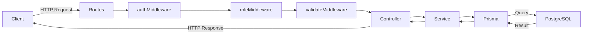

# Arquitectura del Backend

DishSync Backend segueix una arquitectura en capes inspirada en el patró **Bulletproof Node.js**, que separa clarament les responsabilitats de cada part de l'aplicació per facilitar el manteniment, la testabilitat i l'escalabilitat.

---

## Estructura de carpetes

```
src/
├── server.ts               # Punt d'entrada: crea l'app Express i arrenca el servidor
├── config/
│   └── env.config.ts       # Configuració centralitzada de variables d'entorn
├── loaders/
│   ├── index.ts            # Inicialitza Prisma i Express en ordre
│   ├── express.ts          # Configura middlewares globals, rutes i gestió d'errors
│   └── prisma.loader.ts    # Instancia i exporta el client de Prisma
├── api/
│   ├── routes/             # Definició de rutes HTTP per àrea funcional
│   ├── controllers/        # Gestió de peticions/respostes HTTP
│   └── middlewares/        # Auth, rols, validació Zod, upload, errors
├── models/                 # Esquemes Zod (DTOs de validació de requests)
├── services/               # Lògica de negoci i accés a dades via Prisma
├── utils/                  # Utilitats transversals (AppError, tokens, geocodificació)
└── workers/                # Workers en segon pla (email, expiració de reserves)
```

---

## Capes i responsabilitats

| Capa | Carpeta | Responsabilitat |
|---|---|---|
| **Configuració** | `config/` | Centralitza i exporta totes les variables d'entorn tipades. Cap altre fitxer llegeix `process.env` directament. |
| **Loaders** | `loaders/` | Bootstrap de l'aplicació: connexió a la BD, configuració d'Express i muntatge de rutes. S'executen una sola vegada a l'arrencada. |
| **Rutes** | `api/routes/` | Declara els endpoints HTTP i encadena els middlewares i el controlador corresponent. No conté lògica de negoci. |
| **Controladors** | `api/controllers/` | Rep la petició HTTP, extreu els paràmetres necessaris, crida el servei adequat i retorna la resposta. No conté lògica de negoci ni consultes a BD. |
| **Serveis** | `services/` | Conté tota la lògica de negoci. Interactua amb Prisma per fer operacions a la base de dades. És la capa que pot ser testada independentment de HTTP. |
| **Models / DTOs** | `models/` | Esquemes Zod que validen i tipen les dades entrants de les peticions. S'utilitzen des dels middlewares de validació. |
| **Middlewares** | `api/middlewares/` | Funcions intermediàries per autenticació, control de rols, validació de body, gestió de pujada de fitxers i errors globals. |
| **Utils** | `utils/` | Funcions de suport reutilitzables: classe `AppError`, generació de tokens de reserva, geocodificació d'adreces. |
| **Workers** | `workers/` | Processos `worker_threads` per tasques asíncrones que no han de bloquejar el fil principal: enviament d'emails i expiració de reserves. |

---

## Flux d'una petició HTTP



### Descripció del flux

1. **Routes** — Rep la petició i encadena els middlewares declarats per a aquella ruta.
2. **authMiddleware** — Verifica el JWT de la cookie. Si no és vàlid retorna `401`.
3. **roleMiddleware** — Comprova que el rol de l'usuari autenticat és un dels permesos per a l'endpoint. Si no, retorna `403`.
4. **validateMiddleware** — Valida el cos de la petició contra l'esquema Zod corresponent. Si falla retorna `400` amb els errors de validació.
5. **Controller** — Extreu dades de `req` i crida el servei. Gestiona la resposta HTTP.
6. **Service** — Executa la lògica de negoci i fa les consultes a Prisma.
7. **Prisma** — Tradueix les operacions a SQL i les executa contra PostgreSQL.

> Les rutes públiques (p. ex. formulari de reserves, confirmació per token, localitzacions de restaurants) no passen pels middlewares d'autenticació ni de rols.

---

## Bootstrap de l'aplicació

El fitxer `src/server.ts` és el punt d'entrada. Crea l'app Express i delega la inicialització a `initLoaders`:

```
server.ts
  └── initLoaders(app)
        ├── prisma.$connect()        → Connexió a PostgreSQL
        └── expressLoader(app)
              ├── CORS
              ├── JSON body parser (límit 15 MB)
              ├── URL-encoded parser
              ├── Cookie parser
              ├── /public (fitxers estàtics)
              ├── /api   (router principal)
              ├── Handler 404
              └── errorMiddleware (global)
```

---

## Gestió d'errors

Tots els errors es propaguen amb `next(error)` fins al middleware global `errorMiddleware`, que és l'últim middleware muntat a Express. Diferencia entre:

- **`AppError`** — errors operacionals esperats (p. ex. recurs no trobat, dades invàlides). Retorna el codi HTTP i el missatge definits.
- **Errors no controlats** — retornen `500 Internal Server Error` sense exposar detalls interns.

---

## Patró Bulletproof Node.js

Els principis principals que s'apliquen:

- **Separació de capes** — cap capa accedeix directament a les responsabilitats d'una altra capa no adjacent.
- **Configuració centralitzada** — totes les variables d'entorn passen per `env.config.ts`.
- **Serveis independents de transport** — la lògica de negoci als serveis no coneix res de HTTP.
- **Loaders separats** — la inicialització de cada peça de la infraestructura és independent i es pot modificar sense afectar la resta.
- **Workers aïllats** — les tasques asíncrones pesades corren en `worker_threads` separats per no bloquejar el fil principal.
