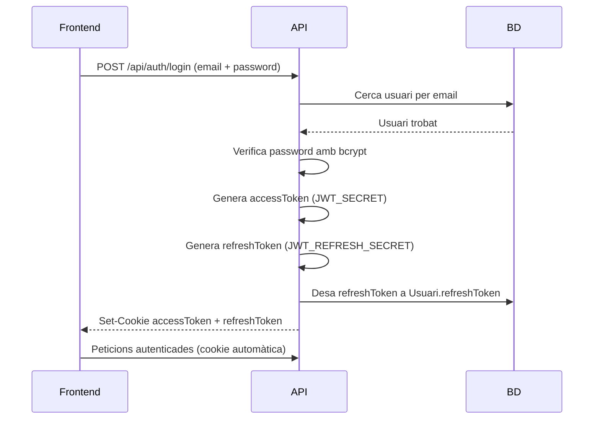
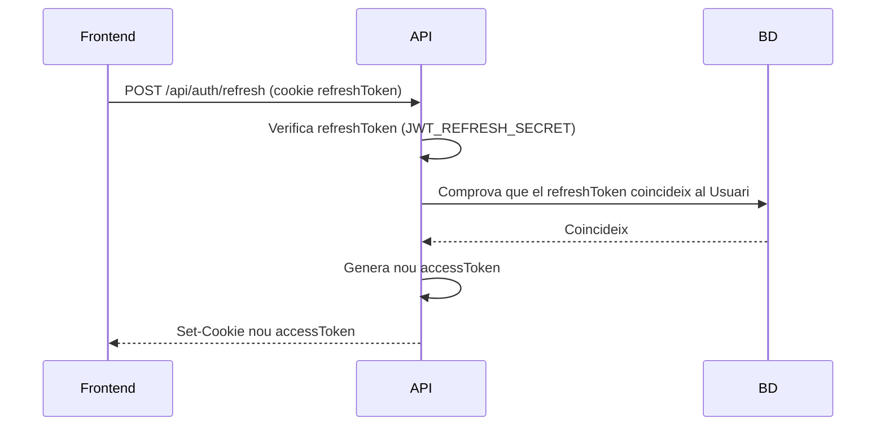
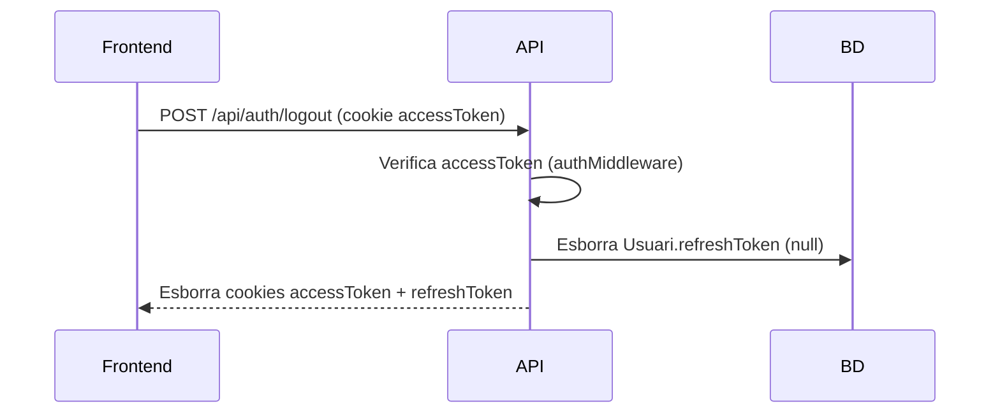

# Autenticació i autorització

DishSync utilitza **JWT (JSON Web Tokens)** per autenticar el personal intern de l'aplicació. Els tokens s'envien i es reben en **cookies HTTP-only** per evitar l'accés des de JavaScript del client.

L'autenticació és exclusiva del personal intern (`Usuari`). Els clients que fan reserves no necessiten compte.

---

## Tipus de tokens

| Token | Cookie | Durada | Emmagatzematge |
|---|---|---|---|
| `accessToken` | `accessToken` (HTTP-only) | Curta (p. ex. 15 min) | Només en cookie |
| `refreshToken` | `refreshToken` (HTTP-only) | Llarga (p. ex. 7 dies) | Cookie + camp `refreshToken` al model `Usuari` en BD |

---

## Flux de login



1. El frontend envia `email` i `password` al endpoint `POST /api/auth/login`.
2. L'API busca l'usuari a la BD i verifica la contrasenya amb `bcrypt.compare`.
3. Es generen dos JWT: `accessToken` (vida curta) i `refreshToken` (vida llarga).
4. El `refreshToken` es desa al camp `Usuari.refreshToken` de la BD.
5. Ambdós tokens s'envien en cookies **HTTP-only** (no accessibles per JS del navegador).
6. Les peticions posteriors inclouen les cookies automàticament.

---

## Flux de renovació del token (`/api/auth/refresh`)

Quan l'`accessToken` ha expirat, el frontend pot renovar-lo sense tornar a fer login:



Si el `refreshToken` no és vàlid o no coincideix amb el de la BD, es retorna `401` i cal fer login de nou.

---

## Flux de logout (`/api/auth/logout`)



---

## Middlewares d'autenticació i autorització

### `authMiddleware`

Protegeix qualsevol ruta que requereixi un usuari autenticat. El seu comportament:

1. Extreu el `accessToken` de les cookies de la petició.
2. Verifica la signatura i l'expiració amb `JWT_SECRET`.
3. Afegeix les dades de l'usuari decodificat a `req.user`.
4. Si el token no és present o no és vàlid, retorna `401 Unauthorized`.

### `roleMiddleware` / `checkRole(...rols)`

S'aplica després de `authMiddleware` per restringir l'accés per rol:

1. Llegeix `req.user.rol` (establert per `authMiddleware`).
2. Comprova que el rol de l'usuari es troba entre els rols permesos per a la ruta.
3. Si no té el rol necessari, retorna `403 Forbidden`.

### Exemple d'ús en rutes

```typescript
// Només accessible per ADMIN
router.get("/", authMiddleware, checkRole("ADMIN"), controller.getAll);

// Accessible per RESPONSABLE o CAMBRER
router.patch("/:id", authMiddleware, checkRole("RESPONSABLE", "CAMBRER"), controller.update);
```

---

## Rols i permisos

| Rol | Descripció | Accés principal |
|---|---|---|
| `ADMIN` | Administrador global | Gestió de restaurants, usuaris, carta, configuració |
| `RESPONSABLE` | Responsable d'un restaurant | Reserves del seu restaurant, disponibilitat de plats |
| `CAMBRER` | Personal de sala | Consulta i gestió de reserves del seu restaurant |

> Els usuaris amb rol `RESPONSABLE` i `CAMBRER` sempre estan assignats a un restaurant concret (`id_restaurant`). L'`ADMIN` pot no tenir restaurant assignat.

---

## Variables d'entorn relacionades

| Variable | Descripció |
|---|---|
| `JWT_SECRET` | Secret per signar i verificar l'`accessToken` |
| `JWT_REFRESH_SECRET` | Secret per signar i verificar el `refreshToken` |

> Vegeu [`environment.md`](./environment.md) per a la referència completa de variables d'entorn.
