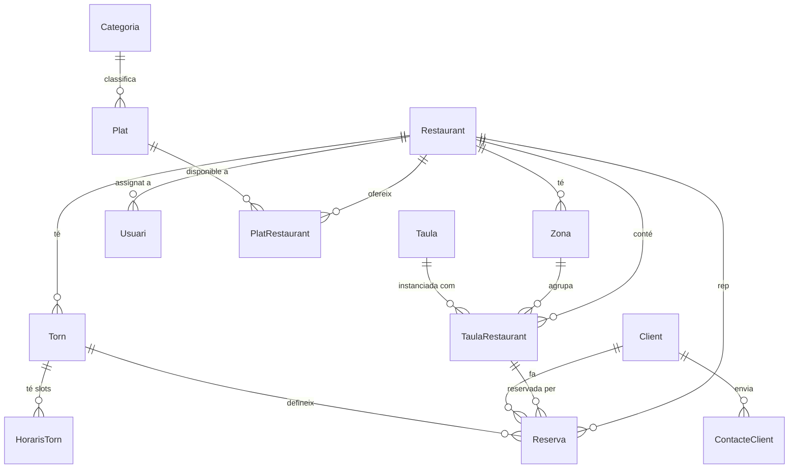

# Models de dades

Aquest document descriu tots els models de la base de dades definits a `prisma/schema.prisma`. La base de dades és **PostgreSQL** i l'ORM utilitzat és **Prisma 7**.

---

## Enums

### `EstatGeneral`
Estat genèric per a entitats que poden activar-se o desactivar-se.

| Valor | Descripció |
|---|---|
| `ACTIU` | L'entitat està operativa |
| `INACTIU` | L'entitat està desactivada (sense eliminar) |

### `EstatReserva`
Cicle de vida d'una reserva.

| Valor | Descripció |
|---|---|
| `PENDENT` | Creada però pendent de confirmació per part del client |
| `RESERVADA` | Confirmada pel client via token d'email |
| `OCUPADA` | La taula és ocupada en el moment del servei |
| `LLIURE` | La taula ha quedat lliure (reserva alliberada pel personal) |
| `CANCELADA` | Cancel·lada pel client via token d'email |
| `EXPIRADA` | No confirmada dins el temps límit (2 minuts), expirada automàticament pel worker |

### `RolUsuari`
Rols del personal intern de l'aplicació.

| Valor | Descripció |
|---|---|
| `ADMIN` | Administrador global: gestiona restaurants, personal, carta i configuració |
| `RESPONSABLE` | Responsable d'un restaurant: gestiona reserves i disponibilitat de plats |
| `CAMBRER` | Personal de sala: consulta i gestiona reserves del seu restaurant |

---

## Models

### `Restaurant` → taula `RESTAURANTS`

Entitat central que representa un establiment.

| Camp | Tipus | Descripció |
|---|---|---|
| `id` | `Int` (PK) | Identificador autoincremental |
| `nom` | `String` | Nom de l'establiment |
| `direccio` | `String` | Adreça postal |
| `lat` | `Float?` | Latitud (geolocalització per mapa) |
| `lng` | `Float?` | Longitud (geolocalització per mapa) |
| `horaris` | `String` | Descripció textual dels horaris |
| `telefon` | `String` | Telèfon de contacte |
| `url` | `String?` | URL del lloc web (opcional) |
| `descripcio` | `String?` | Descripció de l'establiment (opcional) |
| `estat` | `EstatGeneral` | Estat del restaurant (`ACTIU` per defecte) |

Relacions: `zones`, `usuaris`, `torns`, `reserves`, `plats` (PlatRestaurant), `taules_restaurant`.

---

### `Usuari` → taula `USUARIS`

Personal intern de l'aplicació (admin, responsable, cambrer).

| Camp | Tipus | Descripció |
|---|---|---|
| `id` | `Int` (PK) | Identificador autoincremental |
| `id_restaurant` | `Int?` | Restaurant assignat (opcional per a ADMIN) |
| `nom` | `String` | Nom |
| `cognoms` | `String` | Cognoms |
| `email` | `String` (unique) | Correu electrònic (identificador d'accés) |
| `password` | `String` | Contrasenya encriptada amb bcrypt |
| `rol` | `RolUsuari` | Rol (`CAMBRER` per defecte) |
| `estat` | `EstatGeneral` | Estat de l'usuari (`ACTIU` per defecte) |
| `refreshToken` | `String?` | Refresh token JWT emmagatzemat (opcional) |

---

### `Taula` → taula `TAULES`

Tipus de taula (mobiliari): defineix la capacitat i ocupació visual al plànol.

| Camp | Tipus | Descripció |
|---|---|---|
| `id` | `Int` (PK) | Identificador autoincremental |
| `num_persones` | `Int` | Capacitat màxima de persones |
| `span_fila` | `Int` | Cel·les que ocupa en l'eix de files al plànol |
| `span_columna` | `Int` | Cel·les que ocupa en l'eix de columnes al plànol |
| `min_persones_reserva` | `Int` | Mínim de persones per poder reservar aquesta taula |

Relació: `instancies` (TaulaRestaurant).

---

### `TaulaRestaurant` → taula `TAULES_RESTAURANT`

Instància física d'una taula en un restaurant concret, ubicada en una zona i posicionada al plànol.

| Camp | Tipus | Descripció |
|---|---|---|
| `id` | `Int` (PK) | Identificador autoincremental |
| `id_zona` | `Int` | Zona on es troba |
| `id_restaurant` | `Int` | Restaurant al qual pertany |
| `id_taula` | `Int` | Tipus de taula (referència a `Taula`) |
| `fila` | `Int` | Posició en files al plànol |
| `columna` | `Int` | Posició en columnes al plànol |
| `num_taula` | `Int` | Número de taula visible al personal |

Relacions: `zona`, `restaurant`, `tipusTaula`, `reserves`.

---

### `Zona` → taula `ZONES`

Zona de sala dins d'un restaurant (p. ex. terrassa, interior, privat).

| Camp | Tipus | Descripció |
|---|---|---|
| `id` | `Int` (PK) | Identificador autoincremental |
| `id_restaurant` | `Int` | Restaurant al qual pertany |
| `nom` | `String` | Nom de la zona |
| `capacitat_max` | `Int?` | Capacitat màxima de persones (opcional) |

Relació: `restaurant`, `taules` (TaulaRestaurant).

---

### `Reserva` → taula `RESERVES`

Reserva d'una taula per part d'un client per a un torn i data concrets.

| Camp | Tipus | Descripció |
|---|---|---|
| `id` | `Int` (PK) | Identificador autoincremental |
| `id_taula_restaurant` | `Int` | Taula física reservada |
| `id_restaurant` | `Int` | Restaurant de la reserva |
| `id_client` | `Int` | Client que ha fet la reserva |
| `id_torn` | `Int` | Torn de servei |
| `data` | `DateTime` | Data de la reserva |
| `hora` | `String` | Hora de la reserva |
| `num_persones` | `Int` | Nombre de comensals |
| `token` | `String` (unique) | Token únic per a confirmació/cancel·lació per email |
| `data_expiracio` | `DateTime` | Data límit per confirmar (gestiona el worker d'expiració) |
| `estat` | `EstatReserva` | Estat de la reserva (`PENDENT` per defecte) |
| `observacions` | `String?` | Notes opcionals del client |
| `createdAt` | `DateTime` | Data de creació (automàtica) |

---

### `Client` → taula `CLIENTS`

Client extern que fa reserves o envia formularis de contacte.

| Camp | Tipus | Descripció |
|---|---|---|
| `id` | `Int` (PK) | Identificador autoincremental |
| `nom` | `String` | Nom |
| `cognoms` | `String` | Cognoms |
| `email` | `String` (unique) | Correu electrònic (identificador) |
| `telefon` | `String` | Telèfon de contacte |

Relacions: `reserves`, `contactes` (ContacteClient).

---

### `Torn` → taula `TORNS`

Torn de servei d'un restaurant (p. ex. dinar, sopar).

| Camp | Tipus | Descripció |
|---|---|---|
| `id` | `Int` (PK) | Identificador autoincremental |
| `id_restaurant` | `Int` | Restaurant al qual pertany |
| `nom` | `String` | Nom del torn |
| `hora_inici` | `String` | Hora d'inici |
| `hora_fi` | `String` | Hora de fi |

Relacions: `restaurant`, `horaris_torns` (HorarisTorn), `reserves`.

---

### `HorarisTorn` → taula `HORARIS_TORNS`

Slot horari específic dins d'un torn, opcionalment per dia de la setmana.

| Camp | Tipus | Descripció |
|---|---|---|
| `id` | `Int` (PK) | Identificador autoincremental |
| `id_torn` | `Int` | Torn al qual pertany |
| `hora` | `String` | Hora del slot |
| `dia_setmana` | `Int?` | Dia de la setmana (0=diumenge, 6=dissabte), opcional |

---

### `Plat` → taula `PLATS`

Plat del catàleg global de l'aplicació.

| Camp | Tipus | Descripció |
|---|---|---|
| `id` | `Int` (PK) | Identificador autoincremental |
| `id_categoria` | `Int` | Categoria a la qual pertany |
| `nom` | `String` | Nom del plat |
| `descripcio` | `String?` | Descripció (opcional) |
| `preu` | `Decimal(10,2)` | Preu |
| `url` | `String?` | URL de la imatge (opcional) |

Relacions: `categoria`, `disponible_en` (PlatRestaurant).

---

### `Categoria` → taula `CATEGORIES`

Categoria de plats (p. ex. entrants, principals, postres).

| Camp | Tipus | Descripció |
|---|---|---|
| `id` | `Int` (PK) | Identificador autoincremental |
| `nom` | `String` | Nom de la categoria |
| `descripcio` | `String?` | Descripció (opcional) |

Relació: `plats`.

---

### `PlatRestaurant` → taula `PLAT_RESTAURANT`

Relació N:M entre plats i restaurants, amb camp de disponibilitat.

| Camp | Tipus | Descripció |
|---|---|---|
| `id` | `Int` (PK) | Identificador autoincremental |
| `id_restaurant` | `Int` | Restaurant |
| `id_plat` | `Int` | Plat |
| `disponibilitat` | `Boolean` | Si el plat és disponible avui en aquest restaurant (`true` per defecte) |

---

### `ContacteClient` → taula `CONTACTE_CLIENTS`

Missatge enviat per un client via el formulari de contacte públic.

| Camp | Tipus | Descripció |
|---|---|---|
| `id` | `Int` (PK) | Identificador autoincremental |
| `id_client` | `Int` | Client que ha enviat el missatge |
| `missatge` | `String` | Contingut del missatge |
| `estat` | `String` | Estat de gestió (`"Pendent"` per defecte) |
| `createdAt` | `DateTime` | Data de creació (automàtica) |

---

## Diagrama de relacions (ER)

